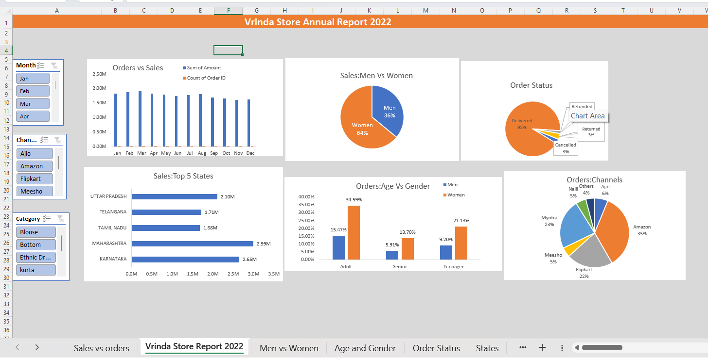

# 🛍️ Vrinda Store Data Analysis | Excel Dashboard

## 📌 Project Overview

The **Vrinda Store Data Analysis** project is an end-to-end **Excel data analysis and dashboard project** focused on analyzing sales performance, customer behavior, order trends, and sales channel performance.

The project transforms raw transactional data into meaningful business insights using **Microsoft Excel, Pivot Tables, Pivot Charts, Slicers, and Data Visualization**.

---

## 🎯 Business Objective

The main objective is to analyze Vrinda Store's annual sales data and identify patterns in:

* 📈 Sales and order trends
* 👩‍🦰👨 Customer gender
* 🎂 Age groups
* 📍 State-wise sales
* 🛒 Sales channels
* 📦 Order status
* 🏷️ Product categories
* 💰 Revenue performance

The analysis helps understand **who the customers are, where they come from, what they purchase, and which channels generate the most orders and sales.**

---

## 🛠️ Tools & Technologies

* **Microsoft Excel**
* Pivot Tables
* Pivot Charts
* Slicers
* Data Cleaning
* Data Analysis
* Data Visualization
* KPI Analysis
* Business Intelligence

---

## 📊 Dashboard

The interactive Excel dashboard provides an overview of Vrinda Store's annual performance.

### Dashboard Highlights

* **Orders vs Sales** – Monthly comparison of sales and order volume
* **Men vs Women** – Gender-wise sales contribution
* **Order Status** – Delivered, cancelled, returned, and refunded orders
* **Top 5 States** – Highest-performing states by sales
* **Age vs Gender** – Customer distribution across different age groups
* **Orders by Channel** – Performance of major sales channels
* **Interactive Slicers** – Filter the dashboard by month, channel, and category

### 📸 Dashboard Preview



---

## 🔍 Key Insights

### 👩 Sales: Men vs Women

Women contribute a significantly larger share of sales compared with men, making them an important target segment for marketing campaigns.

### 📦 Order Status

The majority of orders are successfully delivered, while only a small percentage are cancelled, returned, or refunded.

### 📍 Top Performing States

The dashboard highlights the leading states by sales, including:

* Maharashtra
* Karnataka
* Uttar Pradesh
* Telangana
* Tamil Nadu

### 🛒 Orders by Channel

Major sales channels include:

* Amazon
* Myntra
* Flipkart
* Ajio
* Meesho
* Nalli
* Others

### 🎂 Age & Gender

The analysis compares purchasing behavior across **Adult, Senior, and Teenager** customer groups for both men and women.

---

## 📊 Key Business Questions

This project answers questions such as:

1. Which month generates the highest sales?
2. Which gender contributes more to sales?
3. Which age group has the highest order contribution?
4. Which states generate the highest sales?
5. Which sales channel receives the most orders?
6. What percentage of orders are successfully delivered?
7. Which customer segments should be targeted?
8. Which sales channels should receive more marketing focus?

---

## 🚀 Project Workflow

```text
Raw Sales Data
       ↓
Data Cleaning
       ↓
Data Preparation
       ↓
Pivot Tables
       ↓
KPI Calculation
       ↓
Pivot Charts
       ↓
Interactive Dashboard
       ↓
Business Insights
```

---

## 📂 Project Structure

```text
Vrinda-Store-Data-Analysis/
│
├── 📊 Vrinda Store Data Analysis Project.xlsx
│
├── 📸 Dashboard/
│   └── Vrinda-Store-Dashboard.png
│
└── 📄 README.md
```

---

## 💡 Skills Demonstrated

* Excel Data Analysis
* Data Cleaning
* Data Visualization
* Pivot Tables
* Pivot Charts
* Dashboard Development
* KPI Analysis
* Customer Segmentation
* Sales Analysis
* Business Analytics
* Insight Generation

---

## 👨‍💻 Author

**Dhruv Gupta**

BE – Artificial Intelligence & Machine Learning
Savitribai Phule Pune University

### Skills

`Excel` `SQL` `Python` `Power BI` `Tableau` `Data Analysis` `Pandas` `NumPy`

---

## ⭐ Project Purpose

This project demonstrates the ability to transform raw business data into an **interactive Excel dashboard** and generate actionable insights that can support business decision-making.

If you found this project useful, consider giving it a ⭐ on GitHub.
